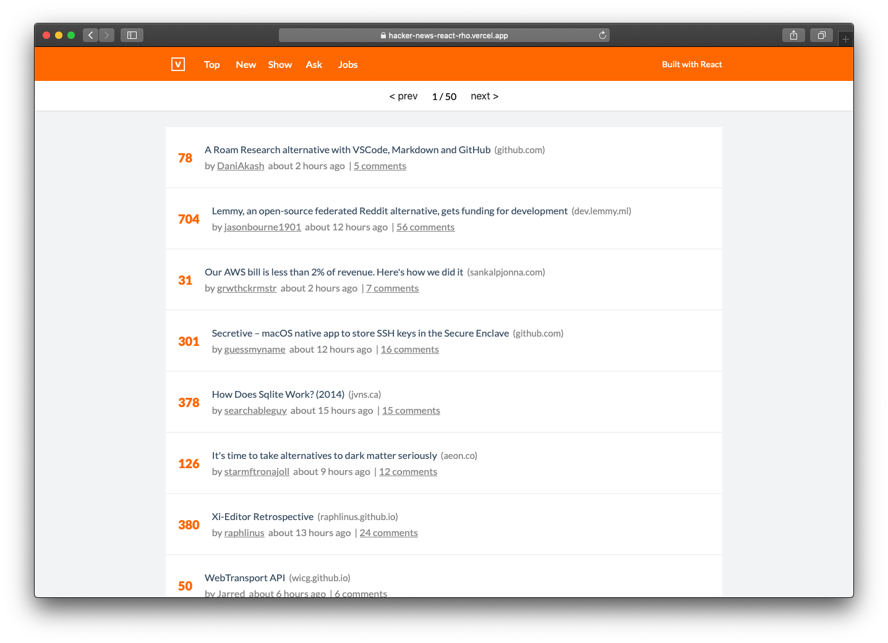
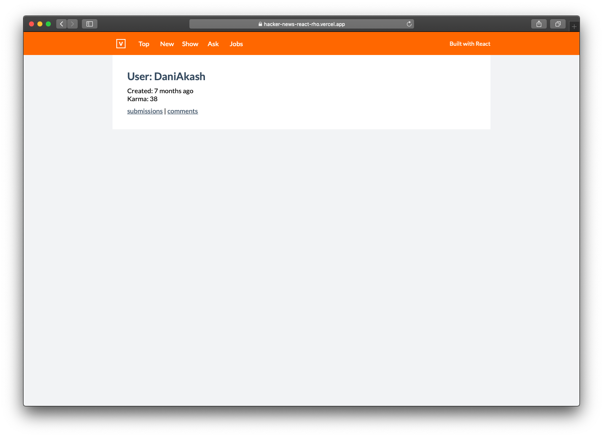

# Hacker News using React.js

    

A Hacker news client based off of VUE HN 2.0 project https://github.com/vuejs/vue-hackernews-2.0. Built using react functional components and hooks. It uses the hacker news firebase
rest api located here https://github.com/HackerNews/API

You can deploy a copy of this app instantly using vercel deploy. Click the button below to get started

And you can also get an editable live version of the app on code sandbox !

##### Screenshots

 

 

 

 

#### Features
* View all of hacker news feeds like ask, show, job etc. 
* View user info
* View comments of each feed item
* Navigate through each feed

#### Technical stuff for Interviewers
This project makes use of the following :

* Typescript
* React Hooks
* React Router
* CSS Modules
* Styled component just for fun
* Fetching and transforming external data
* Nested Comments Rendering with comment folding without using recursion
* Front End monitoring using LogRocket 

This project was bootstrapped with [Create React App](https://github.com/facebook/create-react-app).

#### Available Scripts

In the project directory, you can run:

####  `npm start`

Runs the app in the development mode. 
Open [http://localhost:3000](http://localhost:3000) to view it in the browser.

The page will reload if you make edits. 
You will also see any lint errors in the console.

####  `npm test`

Launches the test runner in the interactive watch mode. 
See the section about [running tests](https://facebook.github.io/create-react-app/docs/running-tests) for more information.

####  `npm run build`

Builds the app for production to the `build` folder. 
It correctly bundles React in production mode and optimizes the build for the best performance.

The build is minified and the filenames include the hashes. 
Your app is ready to be deployed!

See the section about [deployment](https://facebook.github.io/create-react-app/docs/deployment) for more information.

####  `npm run eject`

**Note: this is a one-way operation. Once you `eject`, you can’t go back!**

If you aren’t satisfied with the build tool and configuration choices, you can `eject` at any time. This command will remove the single build dependency from your project.

Instead, it will copy all the configuration files and the transitive dependencies (webpack, Babel, ESLint, etc) right into your project so you have full control over them. All of the commands except `eject` will still work, but they will point to the copied scripts so you can tweak them. At this point you’re on your own.

You don’t have to ever use `eject`. The curated feature set is suitable for small and middle deployments, and you shouldn’t feel obligated to use this feature. However we understand that this tool wouldn’t be useful if you couldn’t customize it when you are ready for it.

